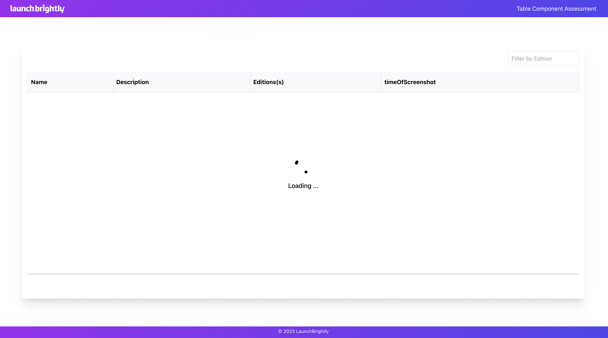

## Table Component
### Props:
The TableComponent does not accept any props.

### Sorting:
To enable sorting, click on the table headers. The table can be sorted based on the following columns:

Name
Description
Editions(s)
timeOfScreenshot
The sorting direction is indicated by an arrow icon displayed next to the column header.

### Filtering:
To filter the table data, enter a search term in the input field labeled "Filter by Edition." The table will be updated to show only the rows that match the entered search term in the edition name or description.

### Loading Indicator:
While the data is being fetched from the API, a loading indicator will be displayed. Once the data is loaded, the table will be rendered.

### Empty Data Handling:
If no data is found or the filter criteria yield no results, a message will be displayed indicating that no data is found.

Credits:
The TableComponent is created by [https://github.com/traj3ctory].